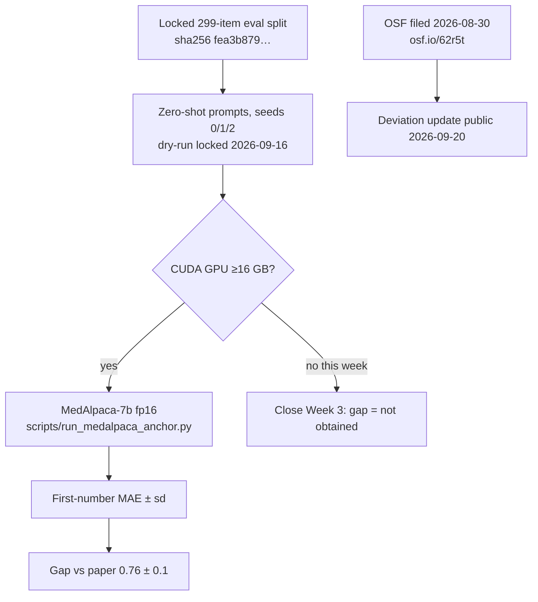

# Fidelity anchor — reproducing one Health-LLM headline number

**Status: Week 3 closed (2026-09-20).** OpenAI fallback ABANDONED 2026-09-16.
Primary MedAlpaca-7b CUDA run is in §6. OSF model-deviation update is public on
https://osf.io/62r5t (20 Sep 2026). Tag `week-03-done`. Do not start Week 4
until the user opens it.

## 1. Anchor target

> **PMData stress prediction, zero-shot, MedAlpaca-7b: MAE 0.76 ± 0.1**
> (Health-LLM, CHIL 2024, Table 3, page 6; mean ± sd over seeds {0, 1, 2}.)

Why this cell (full reasoning in `docs/health-llm-notes.md` §5):

- Open weights — `medalpaca/medalpaca-7b` on Hugging Face; no retired-API risk. The paper's own
  zero-shot GPT-3.5/GPT-4 stress cells are failures ("—"), and Gemini-Pro 1.0 no longer exists,
  so the API cells are unreproducible in 2026 by anyone.
- Zero-shot avoids the few-shot exemplar-leakage confound in their released `inference.py`.

Fallback — **ABANDONED 2026-09-16.** Few-shot `gpt-3.5-turbo-instruct` was attempted; the
org is capped at 50 requests/day despite ~$2,500 in credits (OpenAI support confirmed
credits do not lift rate limits). Do not wait on this cell.

## 2. Reproduction recipe (fallback executed through step 2 on 2026-08-30; step 3 rate-limited)

1. **Data:** download PMData (16 participants, Fitbit Versa 2 + PMSys self-reports) from
   Simula: <https://datasets.simula.no/pmdata/>. Only `pX/pmsys/wellness.csv` and
   `pX/fitbit/{exercise,resting_heart_rate,sleep}.json` are consumed by their generator.
2. **Generate eval split with their code:** `gen_dataset.py`, `DATA="PMData"`,
   `SUBTASK="stress"`, seed 123 record-shuffle, eval = ≤299 items from the second half
   (their lines 716–784), written to `eval/data/pmdata_stress/step1.json`.
3. **Inference with their (patched) code:** zero-shot mode of `inference.py`, MedAlpaca-7b via
   `transformers` pipeline, seeds {0, 1, 2}, `max_tokens≈120`.
4. **Scoring:** the repository releases **no evaluation code at all** (verified 2026-08-27:
   no `eval/` directory; `medalpaca/` holds only training/inference utilities). The MAE the
   paper reports must be re-implemented: we will parse the first number in the generated
   answer, drop unparsable items, and report MAE with the parse-failure rate. This
   re-implementation is itself part of the reproduction gap and is disclosed as such.
5. **Report:** MAE mean ± sd over 3 seeds, plus reproduction gap vs 0.76, plus (our addition,
   clearly separated) the constant-3 baseline MAE ≈ 0.434 on their own label distribution.

## 3. Patches applied to their released code (as executed for the fallback run, 2026-08-30)

The released scripts cannot run as-is; every line reference is verified in
`docs/health-llm-notes.md` §3. Full unified diff: `results/anchor/patches.diff`
(patched copies live next to the originals as `*_patched.py`; originals untouched).

| # | File | Patch | Why |
|---|---|---|---|
| G1–G3 | `gen_dataset.py` | select `DATA="PMData"`, `SUBTASK="stress"`; fill `participant_info` for p01–p16 with placeholders identical to their `p1` stub (none of these fields reach the prompt) | hardcoded to LifeSnaps sleep_quality; KeyError for every real participant dir |
| G4 | `gen_dataset.py` | initialize per-participant channel variables and skip participants with missing files | p12/p13 lack `resting_heart_rate.json`; as released this crashes or silently pairs the previous participant's sensors with the current labels (notes §3.13) |
| adapter | — | map eval keys `question`/`answer` back to `input`/`output` | their generator and inference scripts are mutually incompatible (notes §3.11) |
| I1–I2 | `inference.py` | add missing `import argparse`; drop unconditional `google.generativeai`/`torch`/`transformers` imports | NameError at startup; unrelated heavyweight deps demanded for an API-only run |
| I3–I4 | `inference.py` | OpenAI SDK ≥1.0 client; same call, same params (`gpt-3.5-turbo-instruct`, `max_tokens=120`, API-default temperature) | pre-1.0 `openai.Completion.create(engine=...)` removed from the SDK Nov 2023 |
| I5 | `inference.py` | scope loops to the anchor cell (few-shot, PMData stress) | avoid paying for the other 47 mode×task cells |
| I6 | `inference.py` | call their `set_seed(seed)` at the top of each seed iteration | defined but never called as released; the paper's "seeds {0,1,2}" otherwise control nothing (notes §3.12) |
| I7–I8 | `inference.py` | route through `args.model` with bounded (5×) retries; write outputs under `output/gpt-3.5/` and create the directory | `--model` ignored as released (everything hardcodes gemini-pro); infinite retry loop cannot terminate on persistent errors |
| P2 | `scripts/run_medalpaca_anchor.py` | define the missing `medalpaca_pl` as a transformers text-generation pipeline on `medalpaca/medalpaca-7b`, fp16, CUDA device 0; wrap the list return so the released call site `['generated_text']` works; `return_full_text=False`; greedy (`do_sample=False`); `max_new_tokens=120`; `set_seed` per seed (I6) | `medalpaca_pl` is referenced but never defined (notes §3.5). Full-text pipeline output would make first-number scoring read step counts from the prompt, so completions-only is disclosed. Zero-shot prompt bytes locked 2026-09-16 under `results/anchor/medalpaca/20260916T150339Z_29ef1798/` |

Patch policy: **only** changes needed to make their pipeline execute; no methodological
improvements beyond the disclosed P2 wrap. The reproduction gap is reported with these
patches disclosed. P2 inference itself still needs CUDA.

## 4. Compute plan

MedAlpaca-7b needs ~14 GB in fp16. **This Mac is ruled out** (re-checked 2026-09-16:
Apple M2 Pro, 16 GB unified memory, 14 GiB free disk, no CUDA, no nvidia-smi, torch
not installed, MedAlpaca weights not in the HF cache). Options:

1. A GPU box (16 GB card is sufficient) — required for the primary (MedAlpaca) run **and**
   for the restored open-weights grid (Qwen/Llama via vLLM). Same machine covers both.
   Command: `python scripts/run_medalpaca_anchor.py` (omit `--dry-run`).
2. **Google Colab** — viable for *this* MedAlpaca cell only (not the Week 4 vLLM grid).
   Free T4 (16 GB) is the minimum and may OOM on fp16 with these long prompts; Colab Pro
   L4 (24 GB) or A100 is the runtime that will actually finish. ~897 greedy generations,
   budget 3–6 hours. Use `notebooks/week3_medalpaca_colab.ipynb`: pack a zip locally
   (`bash scripts/pack_colab_anchor.sh`), upload it, write checkpoints to Drive via
   `--out-dir`. Disconnects resume. Do not 4-bit unless fp16 OOMs (disclose if so).
2. Last resort only: 4-bit quantized weights locally (~4 GB) — this deviates from their
   `transformers` fp16 pipeline and would confound the reproduction; if ever used, the
   quantization is disclosed next to the number and the run is repeated on the GPU box.

## 5. User actions required

- [x] PMData: public zip is only 1.4 GB — agent download started 2026-08-27 into
      `data/raw/pmdata/pmdata.zip` (sha256 recorded on completion).
- [x] GPU box (2026-09-20): Plaksha HTI `10.1.45.49`, NVIDIA RTX A6000 48 GB,
      driver/CUDA 580.178.04 / 13.0 after admin reboot. Used for the primary MedAlpaca
      run. Same box is intended for the Week 4–10 vLLM grid (not started).
- [x] OpenAI key provided 2026-08-30 — fallback attempted; **abandoned 2026-09-16** (rate
      limits, not credits).
- [x] OSF model-deviation **update public 2026-09-20** on https://osf.io/62r5t
      (banner: “This is an update to the original registration. This update was
      made on Sep 20, 2026.” Submitted 15:02 UTC, `reviews_state=approved`,
      schema response `6aaff4804f661ffb39d0ab73`). Reason-for-update text matches
      the locked deviation paragraph. Filed Models section is unchanged.

## 6. Results (primary run 2026-09-20)

Artifact: `results/anchor/medalpaca/server_run/run.json`. Host `10.1.45.49`
(RTX A6000 48 GB, driver 580.178.04, torch 2.14.0+cu130, transformers 5.17,
`medalpaca/medalpaca-7b` snapshot `fbb41b75…`, fp16, greedy, `max_new_tokens=120`,
`return_full_text=False`). Prompts byte-identical to the 2026-09-16 lock
(`0abba6a2` / `6789c809` / `50bee721`; eval `fea3b879…`). 897/897 generations;
0 `N/A` swallows.

| Quantity | Paper | Our reproduction | Gap |
|---|---|---|---|
| PMData stress, zero-shot MedAlpaca-7b, MAE (primary) | 0.76 ± 0.1 | **2.689 ± 0.038** (seeds 2.714 / 2.645 / 2.708) | **+1.929** |
| PMData stress, few-shot `gpt-3.5-turbo-instruct`, MAE (fallback) | 0.94 ± 0.1 | — (rate-limited at 35/897 calls; abandoned) | — |
| Parse-failure rate | not reported | 6/897 (2 + 3 + 1) | — |
| Constant-3 baseline MAE (our addition) | not reported | 0.434 on their Table 16 distribution; **0.401 on our locked 299-item eval split** | — |

Honest gap note (not a rescoring): completions are almost all scale suffixes
(`out of 5`, `out of 10`, `.5`). Locked first-number scoring therefore reads 5,
10, or 0.5 (seed 0: 240 / 42 / 15). That is the executed Health-LLM call site
plus our disclosed P2 wrap, not a better post-hoc parser. The paper's 0.76 is
not reproduced. Do not retune the scorer to close the gap.
