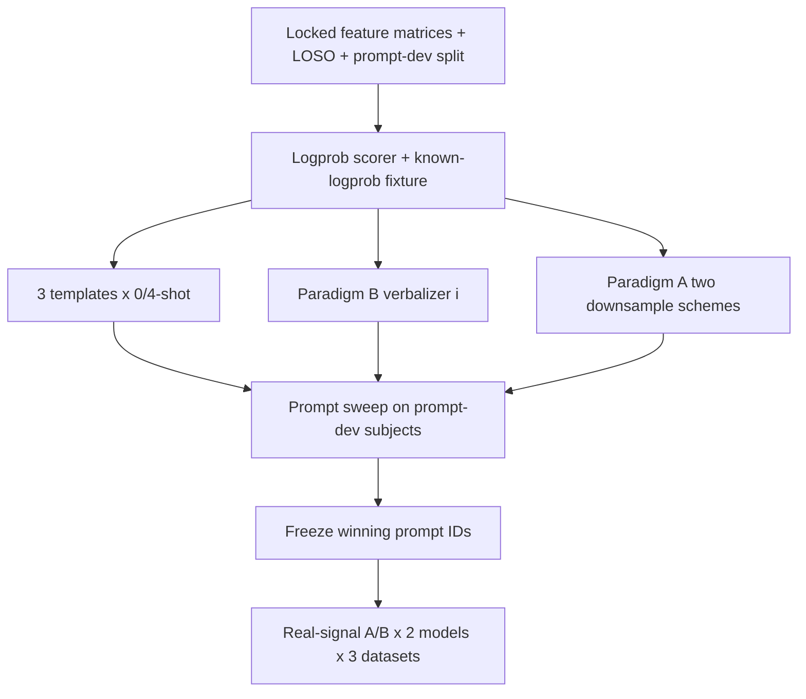

# Week 4 plan — scorer first, then prompts (not the full grid)

<!-- office-hours + autoplan, 2026-09-20. Science is already frozen in OSF / CURSOR_SEMESTER_AGENT §2. -->

## Premise

Weeks 4–5 are one block (`week-05-done`). The next *thing* is not “run Qwen on everything.”
It is the logprob-over-label-tokens scorer plus the prompt/verbalizer path that the
grid will call. Without that, a GPU job is free generation and is illegal for this study.

## Alternatives (office-hours Phase 4)

- **A.** Start the vLLM grid tonight. Rejected: no scorer, no frozen prompts, would burn the A6000 on an illegal generation path.
- **B.** Ship the scorer, A/B tokens, three templates, verbalizer (i), and two downsample functions with tests. Then GPU. **Chosen.**
- **C.** Jump to Week 6 plots. Rejected: sequential gate.

## Locked decisions (not reopened)

- Models: Qwen3-8B-Instruct, Llama-3.1-8B-Instruct, 4-bit, vLLM. Vision waits for Week 6.
- Scoring: one forward pass; argmax over label-token logprobs; missing tokens = scoring failure, never imputed.
- Label tokens are `A` / `B` so they stay one token on both tokenizers. Meanings live in the prompt, not in the scored string.
- Prompt-dev subjects from `prompt_dev_split(..., seed=1337)`. Few-shot exemplars only from those subjects.
- Paradigm B reads `load_locked_feature_matrix` / `assert_matches_locked_floor`.
- Verbalizer variants (ii)/(iii)/(iv) are Week 9. Do not implement them now.
- Surrogates are Weeks 7–8. Do not implement them now.

## This increment (Week 4 start)

1. `physio_placebo.scoring.logprob` + known-logprob fixture test.
2. `configs/label_tokens.yaml`.
3. Three prompt templates × {0-shot, 4-shot} renderers.
4. Verbalizer (i) on locked features, train-fold medians only.
5. Two Paradigm A downsample schemes (uniform stride, bin mean), documented.

vLLM is imported only inside `VLLMLogprobClient.load`. Unit tests never load a GPU.

## This increment (vLLM client + prompt-dev sweep)

6. `scoring/vllm_extract.py` + `scoring/vllm_client.py` — full-vocab label logprobs, no `allowed_token_ids`.
7. Paradigm A series body from the locked primary channel.
8. `prompts/sweep.py` + `scripts/run_prompt_sweep.py` on prompt-dev subjects only.
9. **Do not freeze** until a real `--client vllm` artifact exists.
10. **Do not run the eval grid** until the lockfile is committed.
