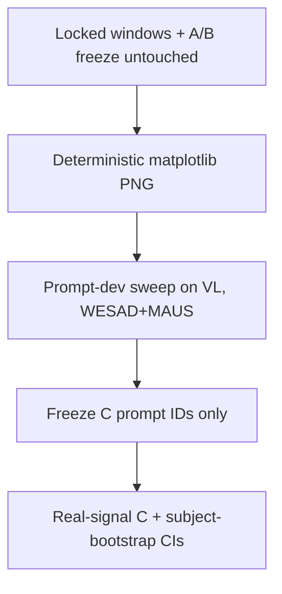

# Week 6 plan — Paradigm C plots, then the same freeze

<!-- CURSOR_SEMESTER_AGENT + OSF are the approved plan. office-hours/autoplan
     skipped (same 2026-08-27 reason). User opened Week 6 on 2026-09-21. -->

## Premise

Weeks 4–5 are closed (`week-05-done`). Week 6 is **plots → Qwen2.5-VL-7B-Instruct**
on WESAD and MAUS only. Same scoring rule (logprob argmax over A/B). Same
prompt-dev sweep, then freeze, then eval-grid CIs. CogWear is out. Surrogates
are Weeks 7–8 — do not implement them.

## Alternatives

- **A.** Feed A/B text models the PNG as base64. Rejected: Week 6 model is Qwen2.5-VL.
- **B.** Deterministic plot renderer, then VL sweep-then-freeze, then eval. **Chosen.**
- **C.** Jump to surrogates. Rejected: sequential gate.

## Locked decisions (not reopened)

- Datasets: WESAD, MAUS. CogWear has no Paradigm C cell.
- Model: `Qwen/Qwen2.5-VL-7B-Instruct` via vLLM, fp16 (same bitsandbytes drop as A/B).
- Primary channel only (same as A): WESAD `ecg`, MAUS `ppg`.
- Plot has no subject id, no class name, no y. Axis labels are time and channel.
- A/B lockfile stays 18 cells. C freeze is `configs/frozen_prompts_c.lock.yaml`.
- Do not retune A/B prompts.
- Do not freeze C from `ConstantClient`.

## This increment (Week 6 start)

1. `physio_placebo.paradigms.plot` + byte-identity test (same window → same PNG).
2. `configs/paradigm_c.yaml` + VL row in `configs/models.yaml`.
3. Sweep / eval / freeze path for paradigm C (WESAD+MAUS).
4. vLLM multimodal request builder. Unit tests never load a GPU.

**Do not write the C lockfile** until a real `--client vllm` sweep exists.
**Do not start Week 7.**

## Closed (2026-09-21)

All four increments ran. Lockfile `configs/frozen_prompts_c.lock.yaml`
(instruction 4-shot × 2). Eval artifact:

- `results/eval_grid/eval_vllm_qwen25_vl.json` (2 cells, 1896 scored, 0 fail)

WESAD 0.412 [0.410, 0.414]; MAUS 0.400 [0.399, 0.400]. Tag `week-06-done`.
Weeks 7–8 (surrogates) are not this file.
